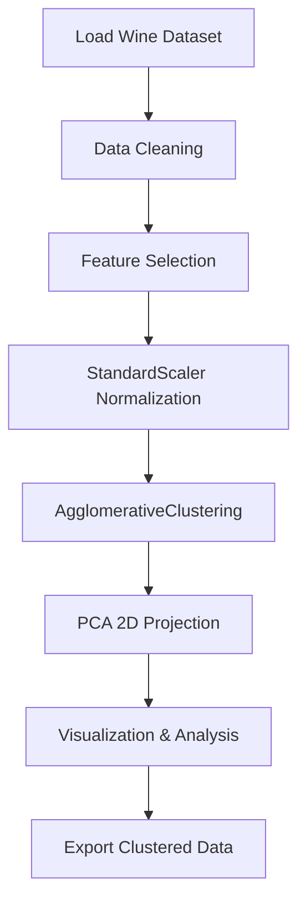

# 🍷 Vineyard Voyager

> **Discover Natural Wine Families Through Unsupervised Machine Learning**

An interactive unsupervised learning project that uses **hierarchical (agglomerative) clustering** to identify natural "families" of wines based on their chemical properties. Built with Streamlit for an intuitive exploration experience!

[](https://vineyard-voyager-project.streamlit.app)
[](https://www.python.org/)
[](LICENSE)

---

## 🎯 Project Overview

**Vineyard Voyager** applies hierarchical clustering to the **UCI Wine Quality Dataset** (red + white wines) to uncover hidden patterns and groupings in wine characteristics. Instead of predicting quality, this project focuses on **discovering natural clusters** based on chemical composition.

### Key Features
- 🔬 **Hierarchical Clustering**: AgglomerativeClustering with Ward, Complete, or Average linkage
- 📊 **PCA Visualization**: 2D scatter plots showing cluster structure
- 🎨 **Interactive Dashboard**: Streamlit app for dynamic exploration
- 📈 **Feature Analysis**: Boxplots and cluster profiles for each chemical property
- 🔍 **Cluster Inspection**: Examine individual wine samples within each cluster
- 📥 **Data Export**: Download clustered data with assigned labels

---

## 🛠️ Tech Stack

- **Python 3.8+**
- **Scikit-learn**: Clustering (AgglomerativeClustering), Scaling (StandardScaler), Dimensionality Reduction (PCA)
- **Pandas**: Data manipulation and cleaning
- **Matplotlib/Seaborn**: Visualization
- **Streamlit**: Interactive web application

---

## 📂 Dataset

This project uses the **UCI Wine Quality Dataset**:
- **Red Wine**: ~1,600 samples
- **White Wine**: ~4,900 samples
- **Features**: 11 chemical properties (acidity, sugar, sulphates, alcohol, etc.)

**Source**: [UCI Machine Learning Repository](https://archive.ics.uci.edu/ml/datasets/wine+quality)

---

## 🚀 Installation & Setup

### 1. Clone the Repository
```bash
git clone https://github.com/mayank-goyal09/vineyard-voyager.git
cd vineyard-voyager
```

### 2. Create Virtual Environment (Optional but Recommended)
```bash
python -m venv venv
source venv/bin/activate  # On Windows: venv\Scripts\activate
```

### 3. Install Dependencies
```bash
pip install -r requirements.txt
```

### 4. Run the Streamlit App
```bash
streamlit run app.py
```

The app will open in your browser at `http://localhost:8501` 🎉

---

## 🎮 How to Use

1. **Download Sample Data**: Get a pre-loaded red wine CSV to experiment with
2. **Upload Your Wine Data**: Use your own CSV file (must have numeric wine features)
3. **Select Features**: Choose which chemical properties to include in clustering
4. **Configure Clustering**:
   - Number of clusters (2-10)
   - Linkage method (Ward/Complete/Average)
5. **Visualize Results**:
   - PCA 2D scatter plot showing cluster separation
   - Feature-by-cluster boxplots
   - Cluster profiles with mean values
6. **Inspect Clusters**: View individual wine samples in each cluster
7. **Download Results**: Export the clustered data with labels

---

## 📊 Project Workflow



---

## 🔍 Example Insights

**Discovered Wine Families** (Example with 4 clusters):
- **Cluster 0**: High alcohol, low acidity → Full-bodied wines
- **Cluster 1**: High residual sugar, low alcohol → Sweet, lighter wines
- **Cluster 2**: High sulphates, moderate alcohol → Preservative-rich wines
- **Cluster 3**: Balanced profiles → Standard table wines

---

## 📁 Project Structure

```
vineyard-voyager/
│
├── app.py                  # Main Streamlit application
├── data/
│   ├── red_wine.csv        # Red wine dataset
│   └── white_wine.csv      # White wine dataset (optional)
├── models/
│   └── clustering_model.pkl # Saved clustering model (optional)
├── requirements.txt        # Python dependencies
├── README.md              # Project documentation
├── .gitignore             # Git ignore file
└── LICENSE                # MIT License
```

---

## 🎓 Learning Outcomes

- ✅ Understanding **hierarchical clustering** (agglomerative methods)
- ✅ Feature engineering and **data preprocessing** (scaling)
- ✅ **Dimensionality reduction** with PCA for visualization
- ✅ Building **interactive ML dashboards** with Streamlit
- ✅ Interpreting **unsupervised learning** results

---

## 🌟 Future Enhancements

- [ ] Add **dendrogram visualization** for hierarchical tree structure
- [ ] Implement **elbow method** for optimal cluster selection
- [ ] Include **DBSCAN** and **K-Means** for comparison
- [ ] Add **silhouette score** and other clustering metrics
- [ ] Enable **wine recommendation** based on cluster similarity
- [ ] Support for **time-series wine data** (vintage analysis)

---

## 🤝 Contributing

Contributions are welcome! Feel free to:
- Report bugs 🐛
- Suggest features 💡
- Submit pull requests 🔧

---

## 📜 License

This project is licensed under the **MIT License** - see the [LICENSE](LICENSE) file for details.

---

## 👤 Author

**Mayank Goyal**
- GitHub: [@mayank-goyal09](https://github.com/mayank-goyal09)
- LinkedIn: [Mayank Goyal](https://www.linkedin.com/in/mayank-goyal-4b8756363/)
- Email: itsmaygal09@gmail.com

---

## 🙏 Acknowledgments

- **UCI Machine Learning Repository** for the Wine Quality Dataset
- **Scikit-learn** for powerful ML tools
- **Streamlit** for making ML apps incredibly simple

---

⭐ **If you found this project helpful, please give it a star!** ⭐
